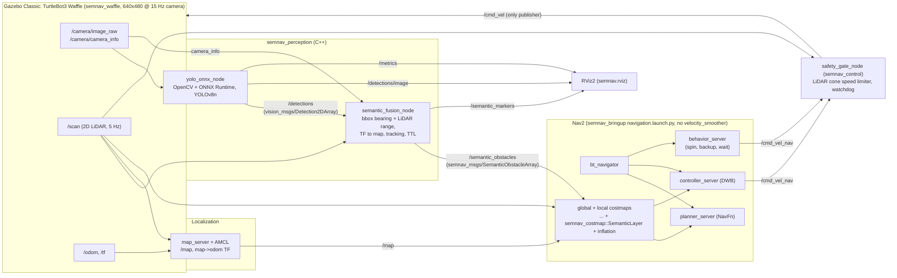

# SemNav: semantic-aware navigation with YOLO, LiDAR and Nav2 (ROS 2 Humble)

SemNav is a simulated TurtleBot3 Waffle that detects objects with its camera, localises them with
its 2D LiDAR, and feeds them into the Nav2 costmaps through a custom C++ costmap-layer plugin, so the
robot plans around *what* things are and not just *where* something solid is. YOLOv8n runs in C++
through ONNX Runtime and OpenCV. A fusion node turns each bounding box into a bearing sector and reads
the matching LiDAR range. The `SemanticLayer` plugin paints class-specific cost discs, for example a
wider, higher-cost area around a person than around a chair. A C++ safety gate between Nav2 and the
wheels limits or zeroes the velocity command based on live LiDAR distance. Everything runs in
Gazebo Classic, and all project code is C++17. Python is used only for launch files and scripts.

Design source of truth: [docs/architecture.txt](docs/architecture.txt) (text of
`docs/SemNav_Architecture.pdf`). Deviations and decisions: [docs/DECISIONS.md](docs/DECISIONS.md).
Design notes: [docs/design-notes.md](docs/design-notes.md).

## Architecture



Notes:
- `controller_server` and `behavior_server` are both remapped `cmd_vel -> cmd_vel_nav`, and the
  stock `velocity_smoother` is not launched. That makes `safety_gate_node` the only `/cmd_vel`
  publisher (D-01, D-02).
- The gate uses a forward cone when `linear.x >= 0` and a rear cone when reversing, so recovery
  backups are also gated. This is a deviation from the PDF's forward-only cone (D-13).
- `SemanticLayer` sits in both costmaps, before inflation: global = static, obstacle, semantic,
  inflation; local = obstacle, semantic, inflation.
- `/metrics` (std_msgs/Float32MultiArray, D-09) carries the YOLO stage latencies p50/p95 and FPS.
  The architecture's `eval_logger_node` / `semnav_eval` package is not implemented. Evaluation is
  done by `scripts/run_eval.sh`.
- All SemNav launch files set `RMW_IMPLEMENTATION=rmw_cyclonedds_cpp` and
  `CYCLONEDDS_URI=.../config/cyclonedds.xml` (D-20). Shells that run `ros2` CLI tools against the
  system must export the same values.

## Quick start

### Prerequisites

- Ubuntu 22.04, ROS 2 Humble (desktop), Gazebo Classic 11 with `gazebo_ros`.
- Nav2 and TurtleBot3 simulation packages, plus the runtime dependencies named in the
  `package.xml` files: `navigation2` (amcl, bt_navigator, controller, planner, behaviors,
  costmap_2d, map_server, navfn, smoother, lifecycle_manager, waypoint_follower, dwb_core),
  `slam_toolbox`, `turtlebot3_gazebo`, `rviz2`, `vision_msgs`, `cv_bridge`, OpenCV, `tf2_ros`,
  `topic_tools` (D-16, debug relay only).
- `rmw_cyclonedds_cpp` (D-20).
- Network access once, for ONNX Runtime, the tf2 underlay, and the Gazebo object models.

Some of these are apt packages that need sudo. Run that step yourself, for example:

```bash
sudo apt install ros-humble-navigation2 ros-humble-slam-toolbox ros-humble-turtlebot3-gazebo \
  ros-humble-vision-msgs ros-humble-topic-tools ros-humble-rmw-cyclonedds-cpp   # needs sudo
```

### 1. UDP receive buffers (needs sudo, run it yourself)

Camera images (921,600 bytes each) travel over UDP with CycloneDDS. The default 208 KB socket
receive buffer drops them (D-19, D-20). Raise the limits:

```bash
sudo sysctl -w net.core.rmem_max=2147483647 net.core.rmem_default=8388608   # needs sudo
```

To keep the setting across reboots, put the same keys in a file under `/etc/sysctl.d/` (needs sudo).

### 2. ONNX Runtime (C++, pinned 1.20.1 CPU)

```bash
scripts/setup_ort.sh        # downloads + SHA-256-verifies into third_party/onnxruntime (gitignored)
```

### 3. tf2 underlay (required on Humble until apt ships tf2 >= 0.25.24)

`ros-humble-tf2` 0.25.23 has an ABBA deadlock between `tf2_ros::Buffer::waitForTransform` and
`tf2::BufferCore::testTransformableRequests`. Under load, it freezes a Nav2 server's TF intake
(D-20). Upstream fixed it in [ros2/geometry2#982](https://github.com/ros2/geometry2/pull/982),
backported it to Humble in [#990](https://github.com/ros2/geometry2/pull/990), and released it in
tag `0.25.24`. Build that tag once into an underlay outside the repo:

```bash
scripts/setup_underlay.sh --test   # clones geometry2 0.25.24 into ~/semnav_underlay, builds tf2 + tf2_ros
```

Then source it in **every** shell, between ROS and the workspace:

```bash
source /opt/ros/humble/setup.bash
source ~/semnav_underlay/install/setup.bash
source install/setup.bash          # after building the workspace with the underlay sourced
```

### 4. Gazebo object models

```bash
scripts/fetch_models.sh      # person_standing, beer, WoodenChair -> src/semnav_bringup/models_external/
```

These models are pinned and gitignored (D-14). Without them, the world shows no objects.

### 5. YOLO model (`models/yolov8n.onnx`)

The model is not in git (`*.onnx`, `*.pt` are gitignored). The detector and two unit tests
(`test_ort_session`, `test_yolo_detector`) expect `models/yolov8n.onnx`. To export it, use a
project venv that is separate from ROS:

```bash
python3 -m venv .venv
.venv/bin/pip install torch torchvision --index-url https://download.pytorch.org/whl/cpu
.venv/bin/pip install -r requirements.txt
# place the Ultralytics YOLOv8n weights at models/yolov8n.pt, then:
.venv/bin/python scripts/export_yolo.py   # static 1x3x640x640, opset 12, output 1x84x8400
```

No repo script downloads `yolov8n.pt`. You must get it from Ultralytics.

### 6. Build and test

From the repo root, which is the colcon workspace (D-11), with ROS and the underlay sourced:

```bash
colcon build --symlink-install --cmake-args -DCMAKE_BUILD_TYPE=Release
colcon test --event-handlers console_direct+ && colcon test-result --verbose
source install/setup.bash
```

### 7. Run

```bash
ros2 launch semnav_bringup semnav.launch.py rviz_software_gl:=true
```

`semnav.launch.py` starts Gazebo and the robot, map_server and AMCL (the initial pose is set
automatically at the spawn pose), perception, and then Nav2 with the safety gate. Send goals with
RViz "2D Goal Pose". `rviz_software_gl:=true` renders RViz with Mesa software GL, which works around
a Map-display shader failure on Intel iGPUs (D-17). The default is `false`.

Other launch arguments:

| Argument | Default | Meaning |
|---|---|---|
| `gui` | `true` | Start gzclient |
| `rviz` | `true` | Start RViz2 |
| `map` | `maps/semnav_world.yaml` | Map for map_server + AMCL |
| `x_pose`, `y_pose`, `yaw` | `-2.0`, `-0.5`, `0.0` | Spawn pose and AMCL initial pose |
| `nav2_params` | `config/nav2_params.yaml` | Nav2 parameters (SemanticLayer config) |
| `perception_params` | `config/perception_params.yaml` | YOLO + fusion parameters |
| `stack_delay` | `8.0` | Seconds after the sim before localization, perception and Nav2 start |
| `use_sim_time` | `true` | Use the Gazebo clock |

Headless: `ros2 launch semnav_bringup semnav.launch.py gui:=false rviz:=false`.

## Results

See [docs/results.md](docs/results.md). It has the semantic layer on/off A/B runs, positioning
error against Gazebo ground truth, and YOLO latency, all produced by `scripts/run_eval.sh`.

## Limitations

- **2D LiDAR scan plane.** Fusion reads ranges from a single horizontal scan plane, at about
  0.17 m in this setup (D-21). Objects or parts of objects above or below that plane, such as a
  table top or overhanging parts, can be missed or mis-ranged. For a person, the LiDAR hits the
  legs. At close range, beams can pass between the legs, which is why the range is the nearest
  cluster rather than the plain median (D-22).
- **Range limit (D-07).** The simulated TurtleBot3 LiDAR covers 0.12 to 3.5 m (360 samples,
  5 Hz). Fusion uses `min_range: 0.12` / `max_range: 3.5`
  (`config/perception_params.yaml`). Beyond 3.5 m, objects are not localised, so position error
  is evaluated over 1 to 3.5 m and not the PDF's 1 to 4 m target.
- **Simulation only.** It has not been tested on a real robot. Camera-LiDAR extrinsics come from
  the URDF, and time sync relies on the sim clock.
- **COCO domain gap.** YOLOv8n is trained on real COCO photos, and the objects here are
  sim-rendered Gazebo models. Detection works for the chosen models (in a 20-frame check, chair
  max confidence 0.917 and person 0.842), but other models or textures may not be detected.
- **Bottle undetected (D-15).** The textured bottle (osrf `beer` model) was not detected even at
  confidence 0.05 in the sanity check. The demo classes are therefore `person` and `chair`
  (`class_filter` default). The bottle stays in the world on purpose, as an obstacle that
  perception misses. It shows that LiDAR, through the obstacle layer and the safety gate, still
  handles geometry when perception fails.
- **tf2 underlay** is required until apt ships tf2 >= 0.25.24 (D-20).
- **No CUDA.** The vendored ONNX Runtime is the CPU build. `use_cuda: true` falls back to CPU with
  a warning (D-12).

## Licenses

- **Ultralytics YOLOv8 weights** are AGPL-3.0 (https://ultralytics.com/license). They are not
  included in this repo. You fetch and export them yourself.
- **Gazebo object models** are fetched by `scripts/fetch_models.sh` (D-14). They are not in git,
  and the script writes `models_external/LICENSES.txt`:
  - `person_standing`: osrf/gazebo_models, author Marina Kollmitz (made with MakeHuman),
    CC BY 3.0.
  - `beer`: osrf/gazebo_models, CC BY 3.0.
  - `WoodenChair`: Gazebo Fuel OpenRobotics/WoodenChair, author Wan Yi Seow (Open Robotics),
    CC0 1.0.
- **ONNX Runtime** is downloaded from the Microsoft GitHub release by `scripts/setup_ort.sh`, under
  its own license.
- **This repository** has no top-level LICENSE file. The `package.xml` files of the SemNav packages
  declare `Apache-2.0`.

## Results (simulation, 2026-10-03)

Full numbers and method: [docs/results.md](docs/results.md).

- Full 10-waypoint benchmark, 5 runs per configuration: 50/50 goals with the semantic layer on and
  50/50 off; YOLOv8n via ONNX Runtime on CPU: total latency p50 ~34.5 ms / p95 ~40.5 ms, 15 fps.
- Fused position error vs ground truth: person ~0.3 m, chair ~0.2 m mean (chair up to 0.58 m from
  one viewpoint).
- **The semantic layer does not yet improve navigation.** With 2 s track expiry it had no
  measurable effect; with persistent tracks (D-25) ghost tracks blocked routes (7/15 goals). After
  track confirmation/merging and capping semantic cost below lethal (D-26) the routes past the
  person succeed 15/15 with and without the layer, with the same clearance and path length. The
  intended wider berth around people is not demonstrated in this arena yet (see results.md).
- Known limits: 2D LiDAR at ~0.17 m sees legs, not bodies (D-21, D-22); requires the tf2 0.25.24
  underlay on Humble (see Setup notes).
